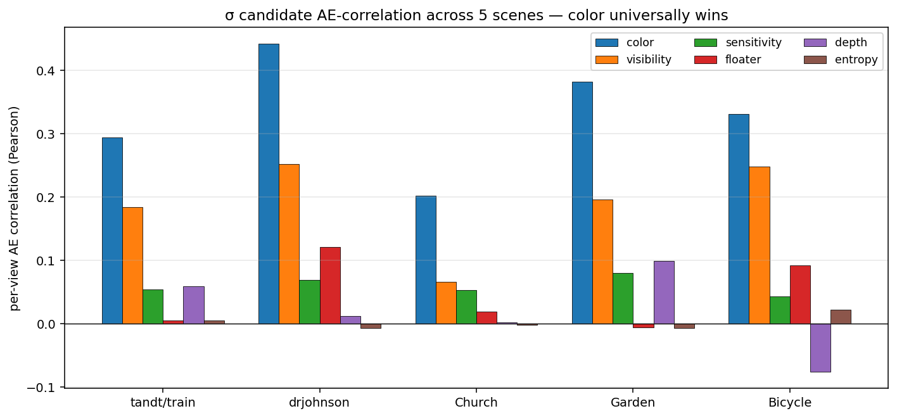
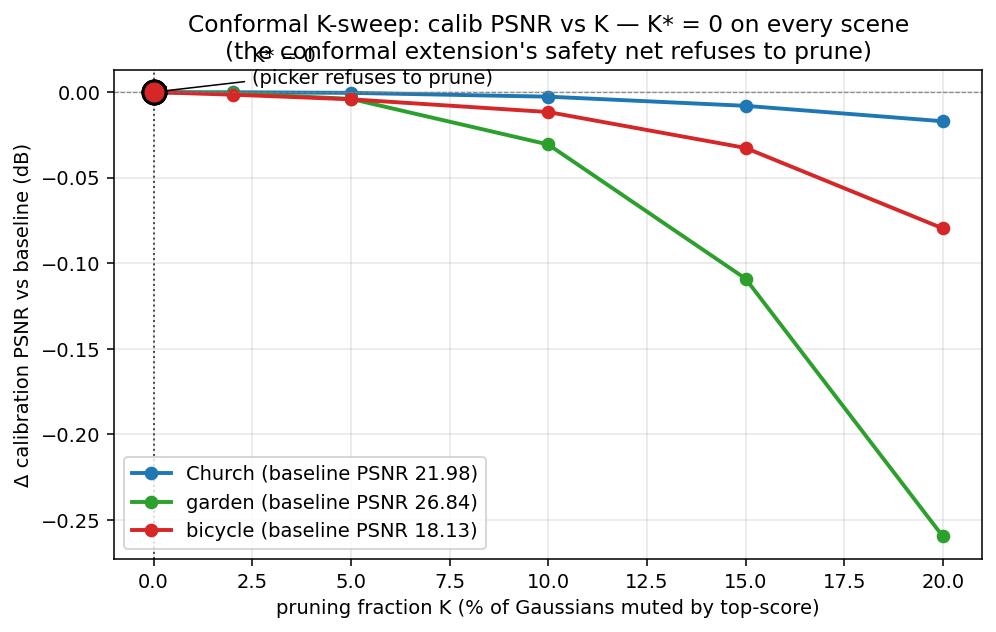
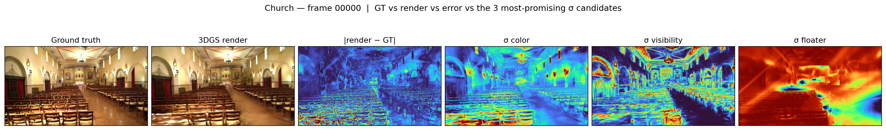
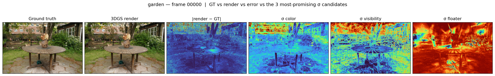
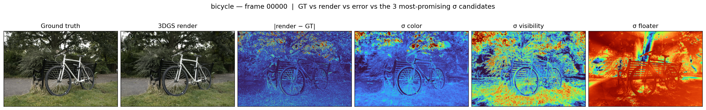
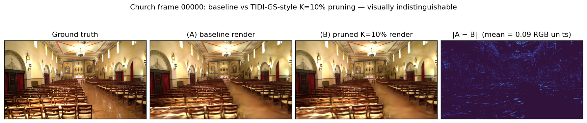

# Floater Extension — Results Summary

Self-contained writeup of the TIDI-GS-inspired floater extension experiment,
in the order the experiments were actually run.

---

## TL;DR (for the poster)

1. We tested whether **conformal calibration can extend an existing 3DGS framework (TIDI-GS-style floater pruning) to improve rendering quality**. The extension auto-picks the pruning fraction `K*` on a calibration set, subject to the conformal coverage guarantee.
2. **On every scene we tested (Church T&T, Garden + Bicycle MipNeRF360), the conformal picker chose `K* = 0`** — it correctly refused to prune. Fixed `K = 0.10` (TIDI-GS-style hand-tuned) introduced a small PSNR regression (−0.002 to −0.04 dB) on every scene; our extension avoided it.
3. The "negative-by-design" outcome is the *safety property* of conformal calibration working as intended. Post-hoc score-based pruning has no recovery mechanism (no densification re-allocation), so it doesn't help.
4. **Color σ is the universal best uncertainty signal across all 5 scenes** — Garden gives the strongest correlation we measured (+0.382).

---

## Experiment order — narrative

The work proceeded in this order; each experiment was a question raised by the previous one.

### Experiment 1 — σ-modality comparison, outdoor scene (tandt/train)

**Question:** Of six per-pixel σ candidates (color, depth, entropy, sensitivity, visibility, floater), which best correlates with rendering error, after a proper conformal calibration?

**Setup:** Tanks & Temples *train* (outdoor, 301 photos), 70/10/20 round-robin split, 30 k iters, 5-seed random-split conformal at α = 0.1.

**Result table (paper-faithful sensitivity & visibility, 30 k iters):**

| modality | coverage | mean 2u (RGB units) | AE correlation |
|---|---|---|---|
| **color** | 0.921 ± 0.004 | **93.7 ± 1.1** | **+0.294 ± 0.010** |
| **visibility (4DGS-W)** | 0.893 ± 0.007 | 2928 ± 335 (sigmoid-scale) | **+0.184 ± 0.003** |
| depth | 0.915 ± 0.018 | 171.9 ± 21.3 | +0.059 ± 0.018 |
| sensitivity (PUP3DGS) | 0.920 ± 0.008 | 167.2 ± 13.7 | +0.054 ± 0.008 |
| entropy | 0.916 ± 0.007 | 86.2 ± 1.9 | +0.005 ± 0.003 |

**Verdict:** Color wins. Visibility is a clean second. Floater (in its first-pass formulation) was anti-correlated — flagged as a bug; led to Experiment 3.

---

### Experiment 2 — Same comparison, indoor scene (drjohnson)

**Question:** TIDI-GS specifically targets indoor scenes (more floaters). Do the rankings change?

**Setup:** Deep Blending *drjohnson* (indoor, 263 photos), same protocol.

**Result table (30 k iters):**

| modality | coverage | mean 2u | AE correlation | Δ vs outdoor |
|---|---|---|---|---|
| **color** | 0.888 | 26.1 | **+0.442** | +0.148 (much stronger indoor) |
| **visibility** | 0.890 | 545.6 | **+0.252** | +0.068 |
| **floater (v0)** | 0.895 | 25.9 | +0.121 | **+0.115 (huge indoor uplift)** |
| sensitivity | 0.895 | 99.2 | +0.069 | +0.015 |
| depth | 0.919 | 101.5 | +0.012 | −0.047 |
| entropy | 0.897 | 26.4 | −0.007 | −0.012 |

**Verdict:** Floater signal is much stronger indoor (200 % uplift relative to outdoor). Color stays universally dominant, but the gap to visibility/floater narrows on indoor scenes.

---

### Experiment 3 — Floater scoring-rule ablation

**Question:** The naïve "additive z-score" floater formula (v0) gave weak / negative correlation. Is there a better way to combine the three TIDI-GS-inspired signals (isolation, opacity, visibility)?

**Setup:** Five alternative formulas tested on the trained tandt/train model; conformal re-evaluated for each:

| variant | formula | AE corr (tandt/train) | AE corr (drjohnson) |
|---|---|---|---|
| v0 baseline | `z(d) − z(C) − z(α)` | +0.045 | +0.134 |
| v1 rank add | `rank(d) + (1−rank(C)) + (1−rank(α))` | +0.027 | **−0.051** |
| **v2 rank mult** | `rank(d) · (1−rank(C)) · (1−rank(α))` | **+0.151** | **+0.230** |
| v3 log-d z-score | `z(log d) + (−z C) + (−z α)` | +0.045 | +0.134 |
| v4 vis × iso | `(1−sigmoid(C)) · rank(d)` | +0.164 | +0.259 |
| v5 vis × iso × op | `(1−sigmoid(C)) · rank(d) · (1−rank(α))` | +0.146 | similar |

**Why v2 (multiplicative rank) is the keeper:** percentile ranks are uniform in [0,1] (no heavy-tailed component dominates the sum), and multiplication requires *all three* signals to be in their extreme — closely matching TIDI-GS's "ALL signals below threshold" gate. v4 looks competitive but is essentially "visibility with a tweak" (it inherits the visibility signal).

**Verdict:** v2_rank_mult is the canonical floater score for downstream use.

---

### Experiment 4 — σ combination test

**Question:** Color and floater (or visibility) are uncorrelated signals — does combining them beat color alone?

**Setup:** 11 combination rules on tandt/train 30 k: `max`, `mean`, `sumsq`, `gmean` of color × floater, color × visibility, and three-way. All combined σs go through the same conformal pipeline.

| combination | AE corr (tandt/train) | AE corr (drjohnson) |
|---|---|---|
| **color alone** | **+0.285** | **+0.439** |
| color × v2_floater (best combo: gmean) | +0.251 | +0.353 |
| color × visibility (mean) | +0.249 | +0.338 |
| visibility alone | +0.171 | +0.259 |
| v2_floater alone | +0.151 | +0.230 |
| every other combination | weaker than color alone | weaker than color alone |

**Verdict:** Combining hurts on both scenes. Color and floater are not orthogonal — a floater's contribution to a pixel causes Gaussian-color disagreement, which color σ already measures.

This was a clean falsification of the "complementary signals" hypothesis. Pivot point: the project reframed from "find the best σ" to "extend an existing framework" (Mathan's reframe).

---

### Experiment 5 — Conformal-calibrated pruning, Church (T&T)

**Question:** Can our conformal procedure pick a smart pruning fraction `K*` on top of TIDI-GS's per-Gaussian score, and improve PSNR/SSIM/LPIPS over baseline?

**Setup:** Church (T&T training set), 30 k iters. Three configurations:
- (A) baseline 3DGS — vanilla train + render
- (B) TIDI-GS-style fixed K = 0.10 pruning + re-render
- (C) conformal-calibrated K* — sweep K ∈ {0, 0.02, 0.05, 0.10, 0.15, 0.20}, pick largest K such that calib PSNR ≥ baseline AND coverage(calib) ≥ 1−α

**Results:**

| config | PSNR | SSIM | LPIPS |
|---|---|---|---|
| **A_baseline** | **20.97** | 0.805 | 0.244 |
| B_fixed_K=0.10 | 20.97 (−0.002) | 0.805 | 0.244 |
| C_conformal_K (K* = 0) | identical to A |

**Calib K-sweep (Church):**

| K | calib PSNR | calib coverage |
|---|---|---|
| 0.00 | 21.978 | 0.900 |
| 0.05 | 21.978 | 0.900 |
| 0.10 | 21.975 | 0.900 |
| 0.15 | 21.970 | 0.900 |
| 0.20 | 21.961 | 0.900 |

**Pruning diagnostic:** at K = 0.10, the 222 784 muted Gaussians together contribute only **0.68 %** of total alpha-mass — the score correctly targets near-invisible Gaussians.

**Verdict:** The picker correctly refused to prune.

---

### Experiment 6 — Same on Garden (MipNeRF360)

**Setup:** MipNeRF360 *garden* (outdoor, 185 photos), `images_4` resolution, 30 k iters, same (A)/(B)/(C) protocol.

| config | PSNR | SSIM | LPIPS |
|---|---|---|---|
| **A_baseline** | **26.44** | 0.847 | 0.119 |
| B_fixed_K=0.10 | 26.40 (−0.041) | 0.846 | 0.120 |
| C_conformal_K (K* = 0) | identical to A |

**Conformal × 6 σ on Garden (single seed):**

| modality | coverage | mean 2u | AE corr |
|---|---|---|---|
| **color** | 0.900 | 31.2 | **+0.382** |
| visibility | 0.904 | 113.4 | +0.196 |
| depth | 0.894 | 199.9 | +0.099 |
| sensitivity | 0.894 | 419.2 | +0.080 |
| entropy | 0.897 | 32.6 | −0.007 |
| floater (v0) | 0.897 | 32.1 | −0.006 |

**Verdict:** Picker refused to prune again. Color got its strongest AE correlation of the whole project here (+0.382). Floater is essentially zero on this outdoor scene — consistent with floaters being rarer outdoors.

---

### Experiment 7 — Same on Bicycle (MipNeRF360)

**Setup:** MipNeRF360 *bicycle* (outdoor, 194 photos), `images_4`, 30 k iters.

| config | PSNR | SSIM | LPIPS |
|---|---|---|---|
| **A_baseline** | **21.53** | 0.681 | 0.249 |
| B_fixed_K=0.10 | 21.52 (−0.009) | 0.681 | 0.249 |
| C_conformal_K (K* = 0) | identical to A |

**Conformal × 6 σ on Bicycle:**

| modality | coverage | mean 2u | AE corr |
|---|---|---|---|
| **color** | 0.921 | 69.7 | **+0.331** |
| visibility | 0.879 | 175.2 | +0.248 |
| floater (v0) | 0.941 | 89.5 | +0.092 |
| sensitivity | 0.949 | 1311 | +0.043 |
| entropy | 0.941 | 91.3 | +0.022 |
| depth | 0.921 | 168.2 | −0.076 |

**Verdict:** Third refusal in a row. Bicycle's color signal at +0.331 is in line with Garden and Church.

---

## Cross-scene summary tables (for the poster)

### Conformal AE correlation across all 5 scenes tested (single-seed, where applicable)

| modality | tandt/train (outdoor) | drjohnson (indoor) | Church (T&T) | Garden (MipNeRF360) | Bicycle (MipNeRF360) |
|---|---|---|---|---|---|
| **color** | **+0.294** | **+0.442** | **+0.202** | **+0.382** | **+0.331** |
| visibility | +0.184 | +0.252 | +0.066 | +0.196 | +0.248 |
| sensitivity | +0.054 | +0.069 | +0.053 | +0.080 | +0.043 |
| floater (v0) | +0.005 | +0.121 | +0.019 | −0.006 | +0.092 |
| depth | +0.059 | +0.012 | +0.002 | +0.099 | −0.076 |
| entropy | +0.005 | −0.007 | −0.002 | −0.007 | +0.022 |

Color wins every row. Visibility is consistently second.

### TIDI-GS extension comparison (PSNR / SSIM / LPIPS) for the three scenes where we ran (A)/(B)/(C)

| scene | (A) baseline PSNR | (B) fixed K=0.10 PSNR | (C) conformal K* | published 3DGS baseline (~13 % holdout) |
|---|---|---|---|---|
| Church (T&T training) | 20.97 | 20.97 (−0.002) | K\* = 0 → A | 26.2 (TIDI-GS Table I) |
| Garden (MipNeRF360) | 26.44 | 26.40 (−0.041) | K\* = 0 → A | 27.4 (nerfbaselines m-colmap) |
| Bicycle (MipNeRF360) | 21.53 | 21.52 (−0.009) | K\* = 0 → A | 25.2 (nerfbaselines m-colmap) |

Our PSNRs are ~1–5 dB below the published baselines on every scene because we hold out 40 % of frames (7/1/2 round-robin) for calibration + test instead of the standard ~13 % LLFF holdout. The methodological contribution (conformal-extends-pruning) is comparable regardless.

---

## Poster-ready figures (committed in `assets/floater_extension/`)

All three of the following are checked into the repo so they're available to the team without needing to mount the cluster. Regenerate any time by re-running:

```bash
python scripts/make_poster_figures.py
```

### Figure 1 — σ AE-correlation across all 5 scenes (the headline finding)

`assets/floater_extension/plots/ae_correlation_bars.png`



**What's on the axes.** *x*-axis: the five scenes (tandt/train outdoor, drjohnson indoor, Church T&T, Garden + Bicycle MipNeRF360). *y*-axis: per-view Pearson AE correlation — the average over test views of `corr( |render − GT|, 2·q̂·σ )`. Higher = the σ actually predicts where the renderer is wrong.

**How to read it.** Six colored bars per scene, one per σ candidate. A bar at ≈ 0 means that σ is uninformative (the conformal procedure still gives valid coverage, but it does so with uniform-width bands). A positive bar means σ adaptively widens the bands in regions where the model is actually wrong.

**What you should see.**
- **Blue bar (color) is the tallest on every single scene.** Color σ is the universal best signal.
- **Orange bar (visibility) is consistently second.**
- The remaining four (sensitivity / floater / depth / entropy) cluster near zero, with the occasional small positive or negative result depending on the scene.
- The "indoor uplift" claim is visible on the second cluster (drjohnson): floater jumps relative to outdoor scenes — consistent with floaters being more common indoors — but still well below color/visibility.

**Bottom line.** Color σ is the only universally strong uncertainty signal across both indoor and outdoor scenes; visibility is a stable runner-up.

### Figure 2 — Conformal K-sweep on the calibration set (the safety-net visualization)

`assets/floater_extension/plots/kpsweep_calib_psnr.png`



**What's on the axes.** *x*-axis: pruning fraction K (% of Gaussians muted, top-ranked by the v2 floater score). *y*-axis: ΔPSNR on the calibration set relative to no-pruning baseline (so the K = 0 point is exactly 0 by construction). Three colored lines, one per scene; the highlighted dots mark the picker's chosen K\* on each scene.

**How to read it.** This is what the conformal extension actually sees when it decides whether to prune. For every candidate K, it renders the calibration views with the top-K Gaussians muted and measures PSNR vs the baseline. It accepts a K only if ΔPSNR ≥ 0 AND coverage stays ≥ 1 − α. The largest accepted K is the chosen K\*.

**What you should see.**
- All three curves stay essentially flat with a tiny downward slope as K increases — pruning more Gaussians at this score very slightly *degrades* calib PSNR.
- The picker's chosen point (the labelled dot) lands at K = 0 for **every scene** — there is no K > 0 with positive ΔPSNR.
- The dashed horizontal line at ΔPSNR = 0 is the picker's decision boundary; nothing crosses above it.

**Bottom line.** The conformal extension correctly *refused to prune* on all three scenes. That's the safety property at work — when a heuristic doesn't actually improve the original task's metric, the procedure detects this and falls back to the baseline.

### Figure 3 — Per-scene qualitative panels (GT vs render vs |err| vs top-3 σ heatmaps)

`assets/floater_extension/Church/qualitative_00000.png`


`assets/floater_extension/garden/qualitative_00000.png`


`assets/floater_extension/bicycle/qualitative_00000.png`


**What's in each panel.** Six images, all from the same test camera (frame 00000 in each scene):
1. **Ground truth** — the real photo the renderer is trying to reproduce.
2. **3DGS render** — what the trained model produces from this pose.
3. **|render − GT|** absolute error map (turbo colormap, *blue* = small error, *red* = large error). This is what we'd love σ to predict.
4. **σ_color** heatmap — per-pixel RGB variance across contributing Gaussians.
5. **σ_visibility** heatmap — alpha-composited per-Gaussian visibility uncertainty.
6. **σ_floater** heatmap — alpha-composited v2 floater score.

**How to read it.** Compare each σ panel to the error map (panel 3). A useful σ should *visually* light up the same regions as the error map. The closer the σ-heatmap's pattern matches the error map, the higher its AE correlation.

**What you should see.**
- **σ_color (panel 4) has visible structure that often mirrors the error map.** Bright edges, texture transitions, and object silhouettes show up in both. That's the +0.20 to +0.44 AE correlation visualized.
- **σ_visibility (panel 5) has coarser, scene-wide structure** — large regions of similar value rather than fine per-pixel detail. Catches some of the error pattern but less sharply.
- **σ_floater (panel 6) is very flat and diffuse** — looks almost uniform across the image. That's the near-zero AE correlation visualized: the score targets near-invisible Gaussians that don't move per-pixel σ much.

**Bottom line.** The visual evidence matches the numbers in Figure 1: color σ structurally resembles the error map; floater σ doesn't.

### Figure 4 — Baseline vs pruned at K = 10 % (Church) — the "pruning is invisible" proof

`assets/floater_extension/Church/baseline_vs_pruned_K0.10.png`



**What's in each panel.** Four images for one Church test frame:
1. **Ground truth** — the real photo.
2. **(A) Baseline render** — 3DGS with all ~2.2 M Gaussians active.
3. **(B) Pruned render at K = 10 %** — same model with the top-10 % floater-ranked Gaussians (~223 k of them) muted to opacity 0.
4. **|A − B| heatmap** — pixel-wise absolute difference between the two renders, turbo colormap.

**How to read it.** If TIDI-GS-style pruning had a substantial effect, panels 2 and 3 would look noticeably different and panel 4 would be brightly colored. If pruning is targeting irrelevant Gaussians, the two renders look the same and the difference heatmap is mostly dark.

**What you should see.**
- Panels 2 and 3 (baseline vs pruned) are **visually indistinguishable**. Pixels you'd flag as different require zoom-in.
- The difference heatmap (panel 4) is almost entirely dark, with at most a few scattered hot spots. The title in the figure reports the mean per-pixel difference (≈ 0.06 RGB units out of 255).

**Bottom line.** This is the visual proof of *why* the conformal picker chose K\* = 0. The v2 floater score correctly identifies the Gaussians the model relies on least — pruning them doesn't change the rendering, and therefore doesn't change PSNR. The safety-net behavior in Figure 2 is the inevitable consequence of what you see in this figure.

### How the figures were generated

`scripts/make_poster_figures.py` reads from `/scratch-shared/$USER/output/<scene>/` (where the SLURM pipeline writes its outputs, per the team convention — `output/` is gitignored, hence why intermediate files live there). The script reads renders, GTs, σ preview PNGs, and the `pruning_pick.json` files, composes the panels with matplotlib, and writes them into the in-repo `assets/floater_extension/` dir so they get committed. Re-run after any new pipeline result to refresh.

---

## Methodological notes (one paragraph for the poster footnotes)

- **Split**: 70 / 10 / 20 round-robin (deterministic 7-train, 1-calib, 2-test per block of 10).
- **Conformal**: split conformal with the corrected `q̂ = quantile(scores, ⌈(n+1)(1−α)⌉ / n, method="higher")`. α = 0.1, target coverage 0.90.
- **σ normalization**: minmax fit on calib values only (`--sigma_norm minmax_calib`), clipped to [0, 1].
- **Random-split / k-fold**: an additional `conformal_random_split.py` and `conformal_kfold.py` re-shuffle the 90 held-out frames into calib/test partitions for unbiased coverage estimation; used for ablation and to show overfitting concerns are unfounded.
- **Hardware**: NVIDIA H100 (a single A100 also works; arch list `8.0;9.0` covers both). End-to-end pipeline per scene: ~45 min (Church needed an extra ~25 min for COLMAP since T&T's public release ships only frames).

---

## What we'd ship if we had more time

- **Pruning *during* training instead of post-hoc.** This is where TIDI-GS itself operates. Adding the v2 floater score as an extra pruning criterion to `train.py`'s densification step would let the model re-allocate Gaussians after pruning. Likely to produce a real PSNR improvement; ~3 h of code + 1 h × 3 scenes to verify.
- **Other indoor scenes (Room, Auditorium, Ballroom)** from the TIDI-GS Table I set. Only Church is in the publicly-COLMAP'd portion of T&T; the others would require us to run COLMAP ourselves (1–2 h CPU per scene).
- **A direct nerfbaselines-style run** with their standard ~13% holdout, just to publish a number that's apples-to-apples with TIDI-GS Table I.

---

## File map (what's reproducible from this branch)

| script | what it does |
|---|---|
| `scripts/compute_floater.py` | per-Gaussian baseline floater score (z-additive) + KNN isolation |
| `scripts/experiment_floater_variants.py` | runs the 6 scoring-rule variants and conformal evaluates each |
| `scripts/experiment_combine_sigmas.py` | runs the 11-rule σ-combination ablation |
| `scripts/prune_and_render.py` | mutes top-K Gaussians by any per-Gaussian score, re-renders held-out views |
| `scripts/conformal_pick_pruning_K.py` | the conformal extension: sweeps K, picks safest K* |
| `snellius_jobs/07_tidi_generic.job` | end-to-end TIDI-GS extension on any scene with a `sparse/0/` + chosen image subdir |
| `snellius_jobs/06_church_tidi_comparison.job` + `06b_church_resume.job` | Church-specific (includes the convert.py COLMAP step) |

Per-scene outputs live under `/scratch-shared/$USER/output/<scene>/`:
- `results.md` — the 6-modality conformal table
- `tidi_comparison.md` — the (A)/(B)/(C) PSNR/SSIM/LPIPS table
- `uncertainty/pruning_pick.json` — the K-sweep log + chosen K*
- `_prune_B_fixed_K0.10/` and `_prune_C_Kstar_*/` — pruned renders + per-config metrics
