# Active Learning Pipeline

This folder contains the active-learning utilities. They are separate from the
basic uncertainty pipeline so AL runs can write to `$OUTPUT_BASE/active_learning/...`
without overwriting standard runs.

On Snellius, the submit scripts default to scratch storage to avoid home/project
quota issues:

```text
OUTPUT_BASE=/scratch-shared/$USER/output
```

You can override this per run:

```bash
OUTPUT_BASE=/scratch-shared/$USER/my_outputs DATASET_NAME=garden ./snellius_jobs/submit_mipnerf_popgs20.sh
```

## Split Layout

Each AL round has:

```text
splits/train.txt       currently labeled/training views
splits/calib.txt       fixed conformal calibration views
splits/test.txt        fixed held-out evaluation views
splits/candidate.txt   unlabeled/selectable candidate views
```

Round 0 is initialized by `splits.py init`:

```text
INIT_TRAIN -> train.txt
CALIB      -> calib.txt
TEST       -> test.txt
remaining  -> candidate.txt
```

The default launcher uses:

```text
INIT_TRAIN=10%
CALIB=10%
TEST=20%
candidate=remaining 60%
```

For later rounds, `calib.txt` and `test.txt` stay fixed. The selected top `K`
candidate views are appended to `train.txt` and removed from `candidate.txt`.

There are two split modes.

### Random Test Mode

This is the generic mode used by the non-MipNeRF wrappers:

```text
all sorted images -> seeded shuffle
first INIT_TRAIN -> train.txt
next CALIB       -> calib.txt
next TEST        -> test.txt
remaining        -> candidate.txt
```

Example with `INIT_TRAIN=10%`, `CALIB=10%`, `TEST=20%`:

```text
10% train
10% calib
20% test
60% candidate
```

### LLFF Holdout Mode

This is the MipNeRF/3DGS-style mode used by the POp-GS presets:

```text
sorted images indexed 0, 1, 2, ...
test.txt = every llffhold-th image
remaining images = train/calib/candidate pool
```

With the default `llffhold=8`:

```text
test.txt = image indices 0, 8, 16, 24, ...
```

`llffhold` is the standard LLFF/MipNeRF holdout convention used by 3DGS-style
evaluation: hold out every Nth view as test. The name comes from the LLFF data
loader option in NeRF/3DGS codebases. Here it keeps the test trajectory fixed and
evenly distributed around the scene.

After taking the LLFF test views out, round 0 does:

```text
INIT_TRAIN -> train.txt
CALIB      -> calib.txt
remaining  -> candidate.txt
```

For generic AL runs, the initial train views are random by default. For the
POp-GS-style MipNeRF presets, `INIT_METHOD=random_fps` is used: the first
initial view is random from the non-test pool, then the remaining initial views
are chosen by farthest-point sampling over COLMAP camera centers.
`INIT_METHOD=first_fps` is also available if you want the FisherRF-code variant
that starts from the first sorted non-test view.

For the POp-GS-style presets:

```text
popgs10: INIT_TRAIN=2, INIT_METHOD=random_fps, ADD_K=1, CAMERA_DISTANCE_PENALTY=0.5, final train views=10
popgs20: INIT_TRAIN=4, INIT_METHOD=random_fps, ADD_K=1, CAMERA_DISTANCE_PENALTY=0.5, final train views=20
```

If `MIN_INDEX_GAP` is set explicitly, the camera-distance penalty defaults to
`0.0`; the two diversity rules are mutually exclusive.

## Acquisition Methods

`splits.py update --method ...` supports:

```text
random                  random candidate views
uniform                 evenly spaced candidate views in sorted image order
conformal_color         color mean calibrated full width
conformal_visibility    visibility mean calibrated full width
conformal_sensitivity   sensitivity mean calibrated full width
conformal_combined      min-max normalized conformal color/visibility/sensitivity average
raw_sensitivity         raw rendered Fisher/sensitivity mean
raw_color               raw rendered color uncertainty mean
raw_visibility          raw rendered visibility uncertainty mean
raw_combined            min-max normalized raw color/visibility/sensitivity average
fisher, pup             aliases for raw_sensitivity
color, visibility       aliases for conformal_color/conformal_visibility
sensitivity             alias for conformal_sensitivity
combined                alias for conformal_combined
```

The raw sensitivity baseline is PUP-style Fisher acquisition: it ranks by the
top 10% foreground/valid pixels in the rendered Fisher/sensitivity map. The
conformal sensitivity method instead uses calibration views to estimate `q_hat`,
then ranks candidate views by the top 10% foreground/valid pixels in
`2*q_hat*u_norm`.

## Combination Rule

`export_rankings.py` computes both raw and conformal per-view statistics over
valid candidate pixels:

```text
color_raw_mean
sensitivity_raw_mean
visibility_raw_mean
color_raw_score
sensitivity_raw_score
visibility_raw_score
color_conformal_mean_full_width
sensitivity_conformal_mean_full_width
visibility_conformal_mean_full_width
color_conformal_score_full_width
sensitivity_conformal_score_full_width
visibility_conformal_score_full_width
```

Conformal scores use calibration views only:

```text
u_norm = min-max normalize uncertainty using calib pixels
q_hat = conformal quantile(|render - gt| / u_norm on calib)
candidate_score = mean(top 10% of 2 * q_hat * u_norm_candidate over valid foreground pixels)
```

Candidate GT is not used for acquisition.

For MipNeRF/POp-GS presets, acquisition defaults to a camera-center diversity
penalty:

```bash
MIN_INDEX_GAP=0 CAMERA_DISTANCE_PENALTY=0.5 CAMERA_DISTANCE_SCALE=0.0 ...
```

This loads COLMAP poses from `SCENE/sparse/0`, computes each candidate's nearest
camera-center distance to the current train/selected set, and downweights nearby
candidates. `CAMERA_DISTANCE_SCALE=0.0` auto-uses the median nearest-neighbor
camera distance. Use either `MIN_INDEX_GAP` or `CAMERA_DISTANCE_PENALTY`, not
both.

To use the older sorted-image anti-clustering rule instead:

```bash
MIN_INDEX_GAP=4 CAMERA_DISTANCE_PENALTY=0.0 ...
```

For combined methods, each available signal is min-max normalized across the
candidate views for that round:

```text
norm_signal(view) = (signal(view) - min_signal) / (max_signal - min_signal)
```

If a signal is constant across candidates, its normalized values are set to 0.

The exported combined scores are:

```text
raw_combined_mean(view) = mean(norm_raw_color, norm_raw_sensitivity, norm_raw_visibility)
conformal_combined_mean(view) = mean(norm_conf_color, norm_conf_sensitivity, norm_conf_visibility)
```

The AL loop's `METHOD=combined` is an alias for `conformal_combined`.

## Running On Snellius

### POp-GS-Style MipNeRF Runs

For direct comparison to the POp-GS single-view selection protocol, use:

```bash
DATASET_NAME=garden ./snellius_jobs/submit_mipnerf_popgs10.sh
DATASET_NAME=garden ./snellius_jobs/submit_mipnerf_popgs20.sh
```

These assume scenes live at:

```text
mipnerf/<dataset_name>
```

The presets use the standard MipNeRF/3DGS LLFF-style holdout:

```text
test views = every 8th sorted image
```

The 10-view preset starts with 2 train views, adds one view per round until 10
views, uses `llffhold=8` for the fixed test set, trains intermediate rounds for
`100 * train_views` iterations, and trains the final 10-view model for 10,000
iterations.

The 20-view preset starts with 4 train views, adds one view per round until 20
views, uses `llffhold=8` for the fixed test set, trains intermediate rounds for
`100 * train_views` iterations, and trains the final 20-view model for 21,000
iterations.

To reduce runtime, intermediate rounds are treated as acquisition rounds rather
than full evaluation rounds:

```text
intermediate rounds: train, render test RGB, compute PSNR/SSIM, render only the signal needed for calib/candidate, select next view
final round: train full model, render calib/test signals, run conformal metrics, compute PSNR/SSIM/LPIPS, aggregate final tables/plots
```

This means LPIPS and per-view conformal test metrics are only complete for the
final round. Intermediate PSNR/SSIM are still logged so learning curves can be
plotted.

Default methods:

```text
uniform
conformal_color
conformal_visibility
conformal_sensitivity
raw_sensitivity
```

The final report files are:

```text
/scratch-shared/$USER/output/active_learning_mipnerf/<dataset>_popgs10/final_metrics.md
/scratch-shared/$USER/output/active_learning_mipnerf/<dataset>_popgs20/final_metrics.md
```

The main diagrams are:

```text
figures/psnr_vs_train_views.png
figures/psnr_vs_train_views_interval_width.png
figures/uncertainty_vs_train_views.png
```

Run default AL jobs for one scene:

```bash
./snellius_jobs/submit_active_learning_db_drjohnson.sh
./snellius_jobs/submit_active_learning_db_playroom.sh
./snellius_jobs/submit_active_learning_tandt_train.sh
./snellius_jobs/submit_active_learning_tandt_truck.sh
```

Defaults:

```text
ITERS=30000
ROUNDS=5
ADD_K=5
METHODS="conformal_color conformal_visibility conformal_sensitivity raw_sensitivity"
```

Run one scene and one method manually:

```bash
SCENE=tandt/train \
AL_ROOT=/scratch-shared/$USER/output/active_learning/tandt_train \
METHOD=conformal_color \
SEED=0 \
ROUNDS=3 \
ADD_K=5 \
ITERS=7000 \
sbatch snellius_jobs/02_active_learning_loop.job
```

Resume a partially completed run from a specific round:

```bash
SCENE=mipnerf/garden \
AL_ROOT=/scratch-shared/$USER/output/active_learning_mipnerf/garden_popgs20 \
METHOD=conformal_visibility \
PRESET=popgs20 \
START_ROUND=10 \
sbatch snellius_jobs/02_active_learning_loop.job
```

Use `END_ROUND` as well if you only want to rerun a short range for debugging.
The split files for `START_ROUND` must already exist.

Each method renders only the signal it needs. For example,
`conformal_color` renders color only, `raw_sensitivity` renders Fisher
sensitivity only, and `conformal_visibility` renders visibility only. Depth and
entropy are not rendered in the active-learning loop unless a future method is
added that uses them.

## Outputs

Per method/seed/round:

```text
/scratch-shared/$USER/output/active_learning/<scene>/<method>/seed_<seed>/round_<rr>/
  splits/
  results.md
  results.json
  conformal/
  active_learning/ours_<iter>/
    view_signal_scores.csv
    view_rankings.json
```

Scene-level summaries:

```text
/scratch-shared/$USER/output/active_learning/<scene>/active_learning_summary.csv
/scratch-shared/$USER/output/active_learning/<scene>/active_learning_summary.md
/scratch-shared/$USER/output/active_learning/<scene>/figures/
```

The figures include PSNR/SSIM/LPIPS learning curves and per-modality
coverage/full-width/AE-correlation/AUSE curves against number of training
views.

For long-running scratch jobs, archive compact results before scratch cleanup:

```bash
AL_RUN=garden_popgs20 DEST=/path/to/archive ./snellius_jobs/archive_active_learning_mipnerf.sh
```

The archive keeps final metrics, learning-curve inputs, split summaries,
rankings, plots, and a small number of preview images. It intentionally does not
copy full checkpoints or all rendered images.

## Aggregating Archived Scenes

After collecting scene archives, aggregate them with:

```bash
python scripts/active_learning/aggregate_scene_archives.py \
  --archives_root al_archives
```

This writes:

```text
al_archives/summary_9scenes/final_metrics_mean.md
al_archives/summary_9scenes/final_metrics_mean.csv
al_archives/summary_9scenes/psnr_vs_train_views_ci95.svg
al_archives/summary_9scenes/psnr_vs_train_views_std.svg
al_archives/summary_9scenes/per_signal/
```

The same report-ready outputs have been copied into:

```text
scripts/active_learning/results/
```

The aggregate plots include FisherRF and POP-GS paper-average reference markers
at 20 views. Those references are not rerun baselines from this repository; they
are reported as paper averages.

## Results

Current nine-scene Mip-NeRF360 20-view summary:

| method | scenes | PSNR ↑ | SSIM ↑ | LPIPS ↓ |
|---|---:|---:|---:|---:|
| Conformal color | 9 | 19.185 ± 4.086 | 0.5602 ± 0.2342 | 0.3824 ± 0.1292 |
| Conformal sensitivity | 9 | 18.803 ± 2.590 | 0.5643 ± 0.1593 | 0.3845 ± 0.0829 |
| Conformal visibility | 9 | 20.508 ± 2.955 | 0.6104 ± 0.1988 | 0.3481 ± 0.1013 |
| Raw sensitivity | 9 | 18.939 ± 2.670 | 0.5737 ± 0.1630 | 0.3781 ± 0.0830 |
| Uniform | 9 | 18.377 ± 1.743 | 0.5346 ± 0.1330 | 0.4031 ± 0.0628 |
| FisherRF avg. (20 views) | paper avg. | 20.568 | 0.6080 | 0.3650 |
| POP-GS avg. (20 views) | paper avg. | 21.320 | 0.6360 | 0.3970 |

Interpretation: conformal visibility is the strongest signal in the current
aggregate. It is close to FisherRF in PSNR, below the POP-GS paper average in
PSNR/SSIM, and better than both references on LPIPS. Do not describe this as
beating FisherRF or POP-GS overall, because the paper references are not matched
reruns under this repository's conformal calibration split.

### Qualitative Results

The active-learning loop repeatedly trains 3DGS, extracts uncertainty signals,
calibrates them with conformal prediction, and selects the next candidate view.

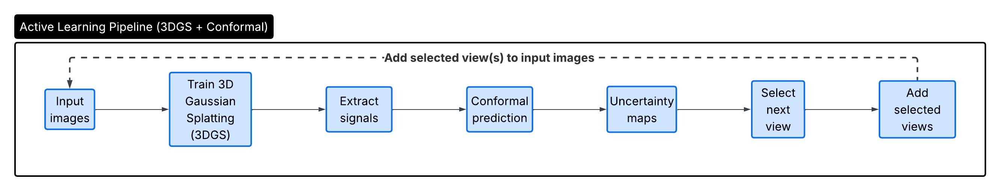

Example render and uncertainty maps:

| Ground truth | Render | Color | Inverse depth |
|---|---|---|---|
| 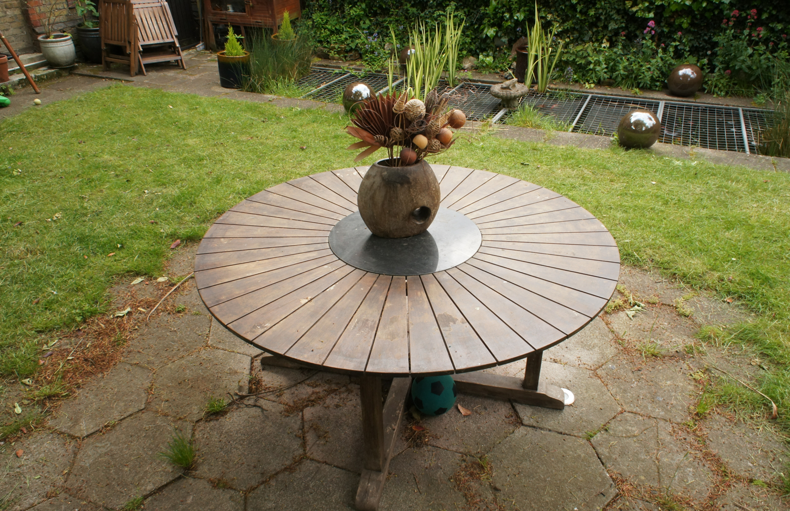 | 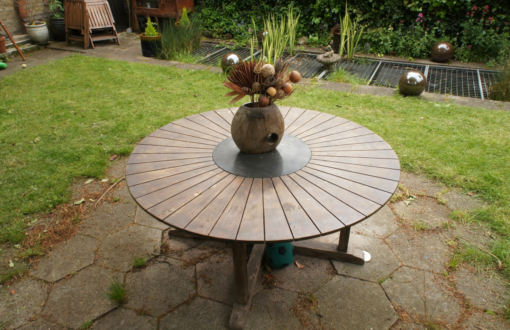 | 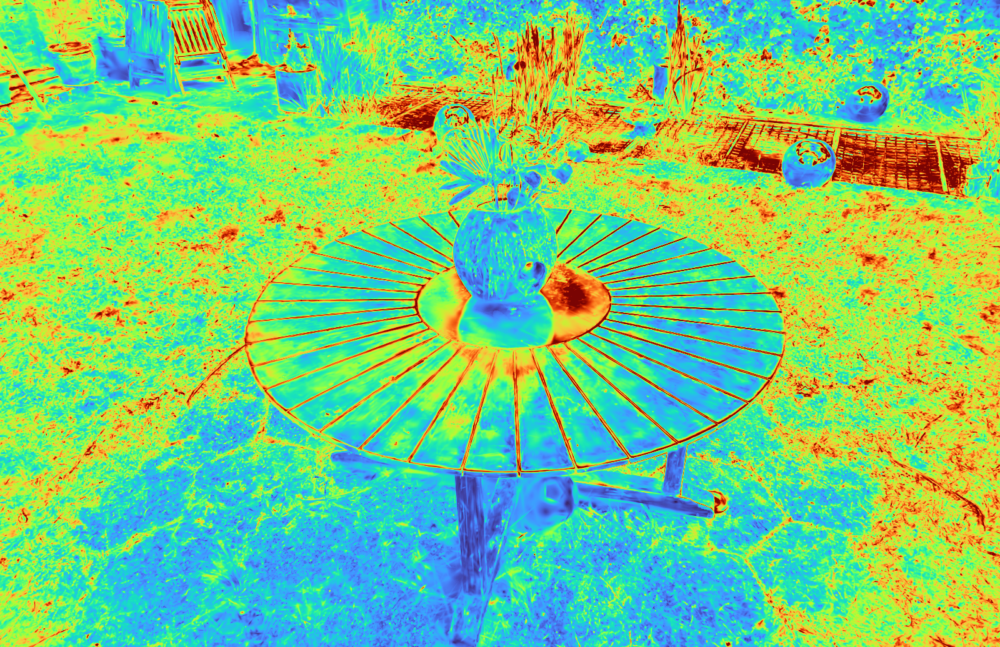 | 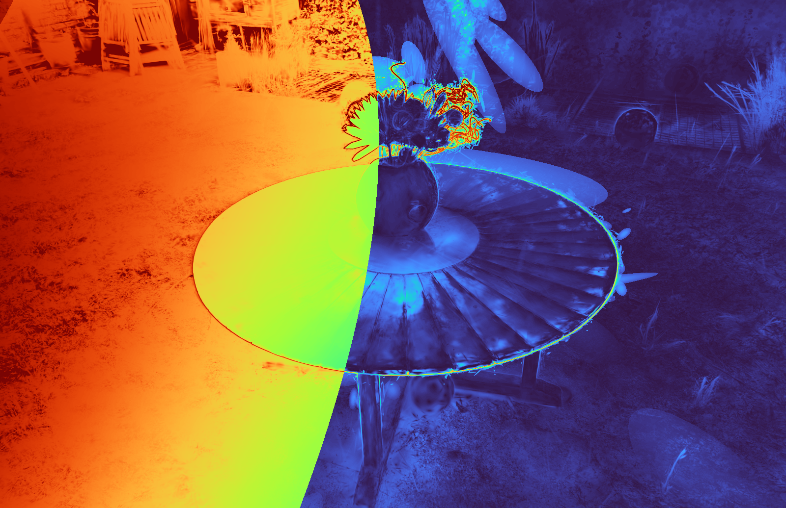 |

| Sensitivity | Visibility |
|---|---|
| 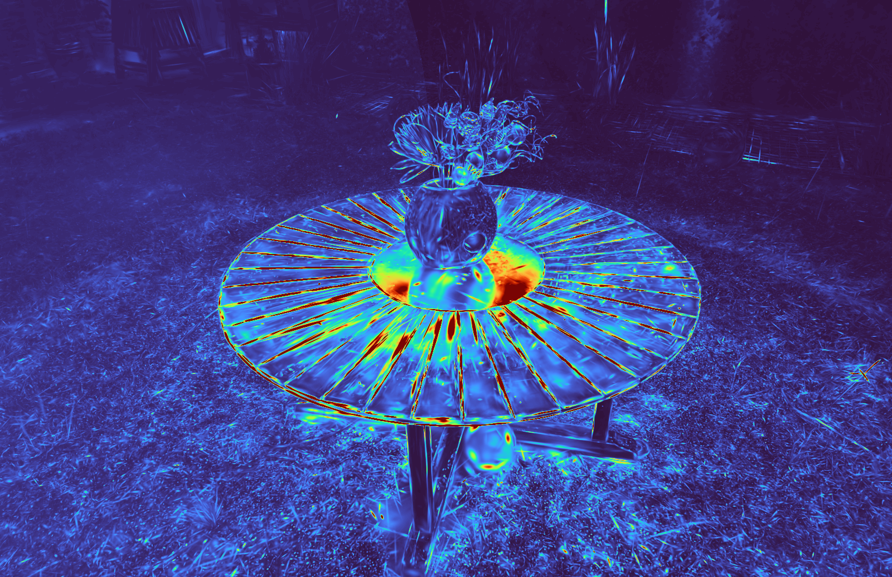 | 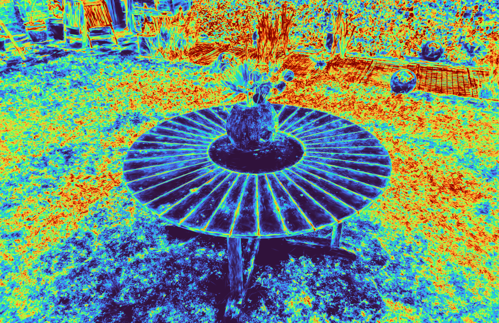 |

Render progression videos are included for the conformal-visibility runs:

| Scene | Standard progression | Active-learning progression |
|---|---|---|
| Bonsai | [bonsai.mp4](results/bonsai.mp4) | [bonsai-al.mp4](results/bonsai-al.mp4) |
| Garden | [garden.mp4](results/garden.mp4) | [garden-al.mp4](results/garden-al.mp4) |
| Treehill | [treehill.mp4](results/treehill.mp4) | [treehill-al.mp4](results/treehill-al.mp4) |

### Aggregate Plots

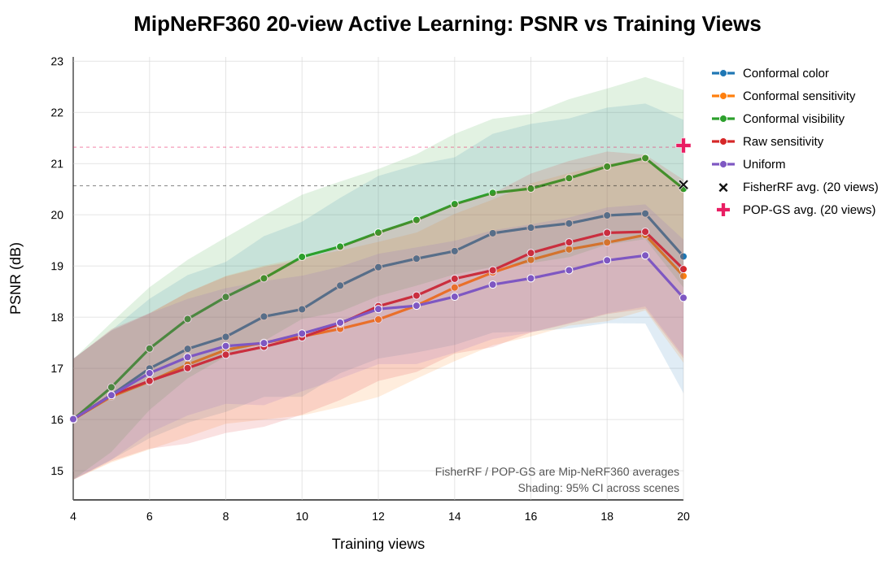

Per-signal report plots:

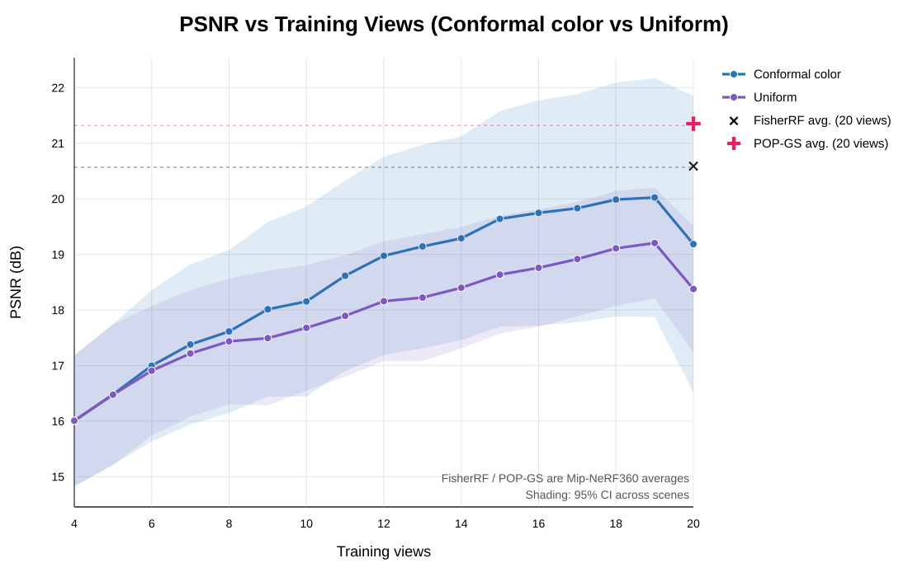

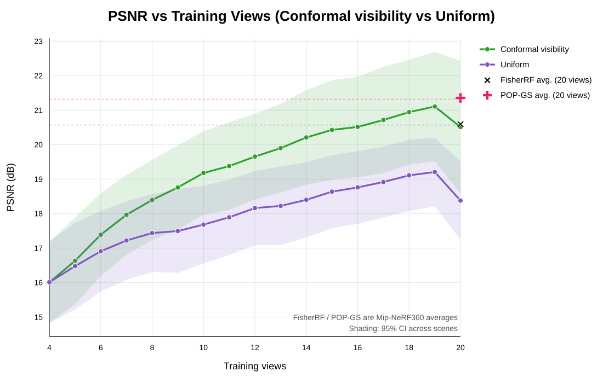

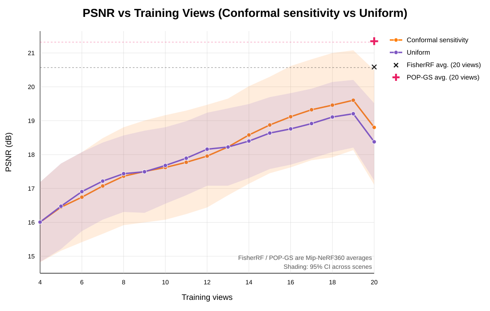

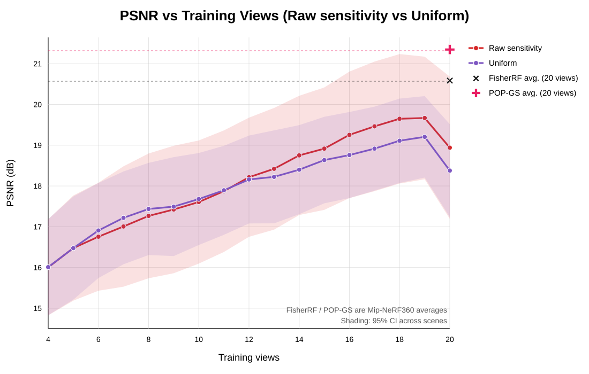
